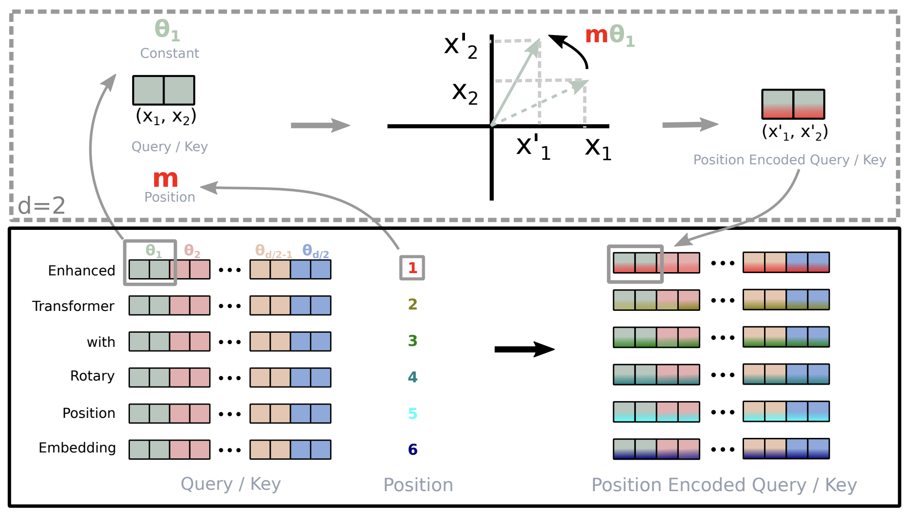
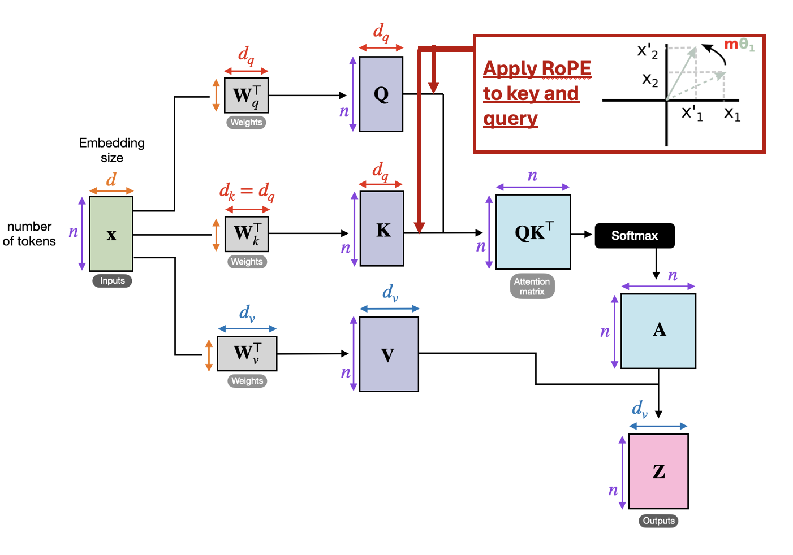

# Homework 8: Language Models for Question Answering

The due date is April 17 at midnight. Please follow the [code squad rules](https://junwei-lu.github.io/bst236/chapter_syllabus/syllabus/#code-squad). If you are using the late days, please note in the head of README.md that "We used XX late days this time, and we have XX days remaining". 

The main purpose of this homework is to help you:

- Build up a language model.
- Solve language modeling tasks with Transformer models.
- Understand the pretraining and finetuning process of language models.
- Implement Hugging Face Transformers library.
- GPU training of language models on cluster.


In this homework, you need to fill in the missing code under `#TODO` in the python files in the `src` folder.  We will give specific instructions for each part. 

We suggest you to test your code on CPU first. If it runs correctly, then you can try to tune the hyperparameters, train the model, and test the model on the GPUs on the class cluster.

This homework involves hours of large model training  (we give the rough training time for each part in the problem description below). Please plan your time accordingly. 

## Problem: Language Models for Celebrities' Birth Place Prediction

You'll train a Transformer to perform a task that involves accessing knowledge about the world — knowledge which isn't provided via the task's training data (at least if you want to generalize outside the training set). You'll find that it more or less fails entirely at the task.
You'll then learn how to pretrain that Transformer on Wikipedia text that contains world knowledge, and find that finetuning that Transformer on the same knowledge-intensive task enables the model to access some of the knowledge learned at pretraining time.
You'll find that this enables models to perform considerably above chance on a held out development set.

The task we'll be working on with our pretrained models is attempting to access the birth place of a notable person, as written in their Wikipedia page.
We'll think of this as a particularly simple form of question answering:

> *Q: Where was [person] born?*  
> *A: [place]*


The code you're provided with is a fork of Andrej Karpathy's [minGPT](https://github.com/karpathy/minGPT) as we introduced in the class. 

You'll need around 3 hours for training, so budget your time accordingly! **Note that dataset multi-processing can fail on local machines without GPU, so to debug locally, you might have to change `num_workers` to 0.**

You need to work the following parts:

### Part a: Warmup with DistilBERT

This part is to help you understand the data. In `wiki.txt`, each line is a Wikipedia text for a person. Each page is written in the following format:

```
Person Name. Person description.
```

The dev set is `birth_dev.tsv`, which contains a list of birth place questions and the expected answers, which serves as the testing set. 

We will first use the [DistilBERT model fine-tuned on SQuAD](https://huggingface.co/distilbert/distilbert-base-uncased-distilled-squad) to predict the answer to the question.


You need to complete the function `predict_answer` in `src/distilbert_prediction.py`. Check the prediction output and explore why the model makes some mistakes.

As a reference point, we also want you to calculate the accuracy the model would have achieved if it had just predicted "London" as the birth place for everyone in the dev set. Take a look at the *evaluation* code which has been implemented for you. It samples predictions from the trained model and calls `evaluate_places()` to get the total percentage of correct place predictions. You will run this code in part (d) to evaluate your trained models.

Fill in `london_baseline.py` to calculate the accuracy of that approach and report your result in the file. You should be able to leverage existing code (e.g. `evaluate_places()`) such that the file is only a few lines long.

### Part b: Read through `NameDataset` in `src/dataset.py`, our dataset for reading name-birthplace pairs.


In `dataset.py`, you'll find the class `NameDataset`, which reads a TSV (tab-separated values) file of name/place pairs and produces examples of the above form that we can feed to our Transformer model.

To get a sense of the examples we'll be working with, if you run the following code, it'll load your `NameDataset` on the training set `birth_places_train.tsv` and print out a few examples.

```bash
python src/dataset.py namedata 
```

Note that you do not have to write any code for this part.

### Part c: Implement finetuning (without pretraining).


Take a look at `run.py`. It has some skeleton code specifying flags you'll eventually need to handle as command line arguments.
In particular, you might want to *pretrain*, *finetune*, or *evaluate* a model with this code. For now, we'll focus on the finetuning function, in the case without pretraining.

Write code to finetune a Transformer model on the name/birthplace dataset, via examples from the `NameDataset` class. For now, implement the case without pretraining (i.e. create a model from scratch and train it on the birthplace prediction task from part (b)). You'll have to modify two sections, marked `[part c]` in the code: one to initialize the model, and one to finetune it. Note that you only need to initialize the model in the case labeled "vanilla" for now (later in section (g), we will explore a model variant).
Use the hyperparameters for the `Trainer` specified in the `run.py` code.

This is an intermediate step for later portions, including Part d, which contains commands you can run to check your implementation. No written answer is required for this part.

**Hint:** Our `run.py` is similar to `play_char.ipynb` in the `mingpt-demo` folder, so the code for this part will be similar to the training code in `play_char.ipynb`.

### Part d: Make predictions (without pretraining).

Train your model on `birth_places_train.tsv`, and evaluate on `birth_dev.tsv`. Specifically, you should now be able to run the following three commands:

```bash
# Train on the names dataset
python src/run.py finetune vanilla wiki.txt \
        --writing_params_path vanilla.model.params \
        --finetune_corpus_path birth_places_train.tsv
        
# Evaluate on the dev set, writing out predictions
python src/run.py evaluate vanilla wiki.txt  \
        --reading_params_path vanilla.model.params \
        --eval_corpus_path birth_dev.tsv \
        --outputs_path vanilla.nopretrain.dev.predictions
```

Training will take less than 10 minutes. Report your model's accuracy on the dev set (as printed by the second command above). Similar to previous assignment, we also have Tensorboard logging in for debugging. It can be launched using `tensorboard --logdir expt/`. Don't be surprised if it is well below 10%. Compare to the reference in Part a.

### Part e: Define a *span corruption* function for pretraining.

In the file `src/dataset.py`, implement the `__getitem__()` function for the dataset class `CharCorruptionDataset`.
Follow the instructions provided in the comments in `dataset.py`.
Span corruption is explored in the [T5 paper](https://arxiv.org/pdf/1910.10683.pdf).
It randomly selects spans of text in a document and replaces them with unique tokens (noising).
Models take this noised text, and are required to output a pattern of each unique sentinel followed by the tokens that were replaced by that sentinel in the input.
In this question, you'll implement a simplification that only masks out a single sequence of characters. Note that we have also provided detailed instructions in the comments on how to implement span corruption in `dataset.py`.

To help you debug, if you run the following code, it'll sample a few examples from your `CharCorruptionDataset` on the pretraining dataset `wiki.txt` and print them out for you.

```bash
python src/dataset.py charcorruption
```

### Part f: Pretrain, finetune, and make predictions.

Now fill in the *pretrain* portion of `run.py`, which will pretrain a model on the span corruption task. Additionally, modify your *finetune* portion to handle finetuning in the case *with* pretraining. In particular, if a path to a pretrained model is provided in the bash command, load this model before finetuning it on the birthplace prediction task.
Pretrain your model on `wiki.txt` (which should take approximately 40-60 minutes), finetune it on `NameDataset` and evaluate it. Specifically, you should be able to run the following four commands:

```bash
# Pretrain the model
python src/run.py pretrain vanilla wiki.txt \
        --writing_params_path vanilla.pretrain.params
        
# Finetune the model
python src/run.py finetune vanilla wiki.txt \
        --reading_params_path vanilla.pretrain.params \
        --writing_params_path vanilla.finetune.params \
        --finetune_corpus_path birth_places_train.tsv
        
# Evaluate on the dev set; write to disk
python src/run.py evaluate vanilla wiki.txt  \
        --reading_params_path vanilla.finetune.params \
        --eval_corpus_path birth_dev.tsv \
        --outputs_path vanilla.pretrain.dev.predictions
```

We expect the dev accuracy will be at least 15%.

### Part g: Write and try out a different kind of position embeddings (Budget about 1 hour for training)

In this part, you will make your model closer to the architecture of modern language models like DeepSeek by adding RoPE to the attention mechanism.

In the previous part, you used the vanilla Transformer model, which used learned positional embeddings. In this part, you'll implement a different kind of positional embedding, called *RoPE* ([Rotary Positional Embedding](https://arxiv.org/abs/2104.09864)).

RoPE is a fixed positional embedding that is designed to encode relative position rather than absolute position. The issue with absolute positions is that if the transformer won't perform well on context lengths (e.g. 1000) much larger than it was trained on (e.g. 128), because the distribution of the position embeddings will be very different from the ones it was trained on. Relative position embeddings like RoPE alleviate this issue.

Given a feature vector with two features $x^{(1)}_t$ and $x^{(2)}_t$ at position $t$ in the sequence, the RoPE positional embedding is defined as:

$$
\text{RoPE}(x^{(1)}_t, x^{(2)}_t, t) = 
\begin{bmatrix}
\cos(t\theta) & -\sin(t\theta) \\
\sin(t\theta) & \cos(t\theta)
\end{bmatrix}
\begin{bmatrix}
x^{(1)}_t \\
x^{(2)}_t
\end{bmatrix}
$$

where $\theta$ is a fixed angle. For two features, the RoPE operation corresponds to a 2D rotation of the features by an angle $t\theta$. Note that the angle is a function of the position $t$.



For a $d$ dimensional feature, RoPE is applied to each pair of features with an angle $\theta_i$ defined as $\theta_i = 10000^{(-2(i-1)/d)}$, $i \in {1, 2, ..., d/2}$.

$$
\begin{bmatrix}
\cos(t\theta_1) & -\sin(t\theta_1) & 0 & 0 & \cdots & 0 & 0 \\
\sin(t\theta_1) & \cos(t\theta_1) & 0 & 0 & \cdots & 0 & 0 \\
0 & 0 & \cos(t\theta_2) & -\sin(t\theta_2) & \cdots & 0 & 0 \\
0 & 0 & \sin(t\theta_2) & \cos(t\theta_2) & \cdots & 0 & 0 \\
\vdots & \vdots & \vdots & \vdots & \ddots & \vdots & \vdots \\
0 & 0 & 0 & 0 & \cdots & \cos(t\theta_{d/2}) & -\sin(t\theta_{d/2}) \\
0 & 0 & 0 & 0 & \cdots & \sin(t\theta_{d/2}) & \cos(t\theta_{d/2})
\end{bmatrix}
\begin{bmatrix}
x^{(1)}_t \\
x^{(2)}_t \\
x^{(3)}_t \\
x^{(4)}_t \\
\vdots \\
x^{(d-1)}_t \\
x^{(d)}_t
\end{bmatrix}
$$

Finally, instead of adding the positional embeddings to the input embeddings, **RoPE is applied to the key and query vectors for each head in each attention block for all the Transformer layers**. See the plot below for how RoPE is applied to the key and query vectors.




In the provided code, RoPE is implemented using the functions `precompute_rotary_emb` and `apply_rotary_emb` in `src/attention.py`. You need to implement these functions and the parts of code marked `[part g]` in `src/attention.py` and `src/run.py` to use RoPE in the model. Note that we have provided hints in the comments on how to implement RoPE in `src/attention.py`.

Train a model with RoPE on the span corruption task and finetune it on the birthplace prediction task. Specifically, you should be able to run the following four commands:

```bash
# Pretrain the model
python src/run.py pretrain rope wiki.txt \
        --writing_params_path rope.pretrain.params
        
# Finetune the model
python src/run.py finetune rope wiki.txt \
        --reading_params_path rope.pretrain.params \
        --writing_params_path rope.finetune.params \
        --finetune_corpus_path birth_places_train.tsv
        
# Evaluate on the dev set; write to disk
python src/run.py evaluate rope wiki.txt  \
        --reading_params_path rope.finetune.params \
        --eval_corpus_path birth_dev.tsv \
        --outputs_path rope.pretrain.dev.predictions
```

We expect the dev accuracy will be at least 30%. Compare the performance of the vanilla model and the RoPE model.


### Part h: Summarize your results

In your `README.md#Report`, summarize your results and answer the questions below.

(1) Succinctly explain how the training losses are different for the pretrain and finetune processes.

(2) Succinctly explain why the pretrained (vanilla) model was able to achieve an accuracy of above 10%, whereas the non-pretrained model was not. 

(3) Take a look at some of the correct predictions of the pretrain+finetuned vanilla model, as well as some of the errors.
We think you'll find that it's impossible to tell, just looking at the output, whether the model *retrieved* the correct birth place, or *made up* an incorrect birth place.
Consider the implications of this for user-facing systems that involve pretrained NLP components.
Come up with two **distinct** reasons why this model behavior (i.e. unable to tell whether it's retrieved or made up) may cause concern for such applications, and an example for each reason.

(4) If your model didn't see a person's name at pretraining time, and that person was not seen at fine-tuning time either, it is not possible for it to have "learned" where they lived.
Yet, your model will produce *something* as a predicted birth place for that person's name if asked.
Concisely describe a strategy your model might take for predicting a birth place for that person's name, and one reason why this should cause concern for the use of such applications.

(While (3) discussed the problems that could arise from made up predictions, (4) asks for a mechanism the model could be using for generating birth places of people not seen at fine-tuning time and why such a mechanism could be problematic.)
